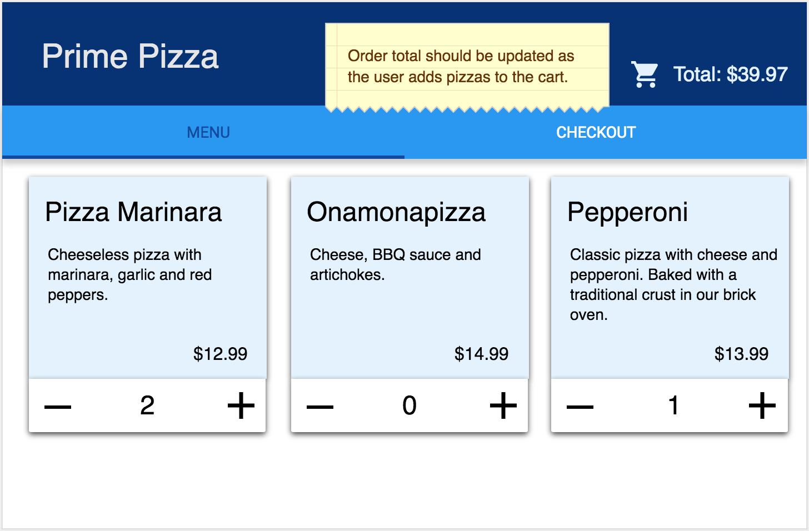
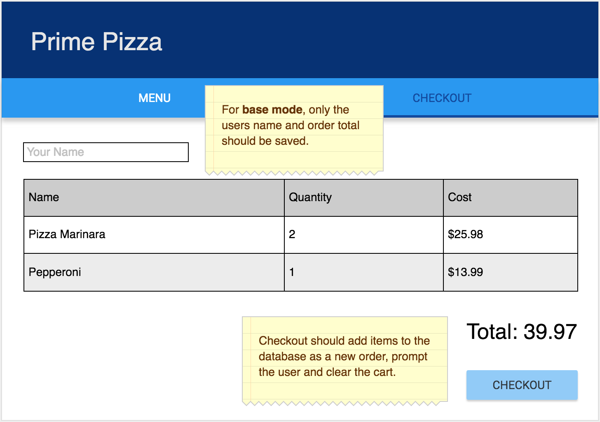
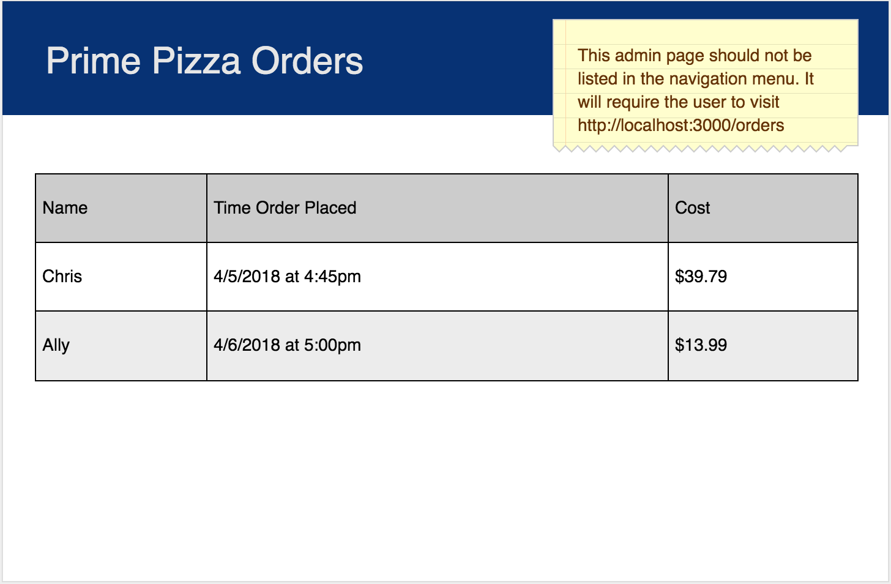

# React Pizza Parlor

Before you get started make sure to read through **ALL** requirements and outline a plan for your group. Assign out tasks and use branches to allow team members to work in parallel.

### Setup

Server side code for baseline functionality has been provided for you. Each member of your team will need to import the list of pizzas into your Mongo Database. Make sure mongo is running `mongod`, open this project folder in terminal and run the following command:

**Import data**

```
mongoimport --db pizza_parlor --collection pizzas --file pizza.csv --type csv --headerline
```

Remember, Mongo creates the database and collections automatically! There is no need to do any additional database work after importing the pizzas. Use `cmd` + `r` in Robo 3T to refresh your list of databases. `pizza_parlor` should now appear in that list.

**Start your server**

```
npm install
npm run server
```

Now that the server is running, open a new terminal tab with `cmd + t` and start the react client app.

**Start your client**

```
npm run client
```

## API DOCS

After starting up the server, the following routes should be available. You can test them with Postman.

### GET PIZZA  

`/api/pizza`

**Returns** an array of objects with *_id*, *name*, *description*, *image_path* and *cost* properties. 

### POST ORDER

`/api/order`

**Post Data** should be an object that contains user information, *name*, *street address*, *city*, *zip*, *order_total* and an array of pizza id's as object. 

**Example Post Data:**

```JavaScript
{
    customer: { 
        name: "Chris",
        street_address: "123 street",
        city: "Minneapolis",
        zip: 55408
    },
    pizzas: [{ 
        _id: "5afc94b8c62836fadd80496c" // _id of pizza, yours will be different!
        name: "Pepperoni",
        description: "Classic pizza with cheese and pepperoni. Baked with a traditional crust in our brick oven.",
        cost: "14.99"
    },
    { 
        _id: "5afc94f3c62836fadd804979"  // _id of pizza, yours will be different!
        name: "Splat of Marinara",
        description: "Cheeseless pizza with marinara, garlic and red peppers.",
        cost: "12.99"
    }],
    order_total: 27.98,
    type: "Pickup"
}
```

### GET ORDERS

`/api/order`

**Returns** an array of orders.


## BASE REQUIREMENTS

Your client has asked your team to build a pizza ordering system. They have provided some of the server side routes and a list of pizzas they currently offer in CSV format (`pizza.csv`). Your team should build out the following views.

### ORDER - SELECT PIZZA

When visiting [http://localhost:3000/](http://localhost:3000/) display all of the pizzas on the screen. Allow users to add or remove each pizza they would like to order. **For base mode, only allow the user to have one of each pizza in their cart.** Show the total cost of items in the cart in the top right of this page. 

This page should have a next button that brings the user to the **enter customer information page**.



### ORDER - ENTER CUSTOMER INFORMATION

Collect user information, *name*, *street address*, *city* and *zip*. This page should have an option to select pickup vs. delivery. The total cost of the order should appear in the top right of this page. This page should have a next button that brings the user to the **checkout** page.



### ORDER - CHECKOUT

Users should not be able to modify item totals on this screen. When they click checkout, the user information, order total and array of pizzas should be sent to the server. After the checkout is complete, navigate the user back to the **select pizza** page.



### ADMIN - ORDERS

This page **should not** appear in the navigation bar. Eventually the client would like to add authentication but for now, it will be available to anyone with the url [http://localhost:3000/admin](http://localhost:3000/admin). This page will display the name, time and order total for each of the orders placed.


## STRETCH GOALS

- Improve the styling of the app using Material-UI cards, buttons, nav bar and icons.
- Allow the user to go back to previous pages (until they've completed checkout).
- Display a list of pizzas for each order on the orders page. 
- Add a button on the orders page to track delivery status.
- Add pictures to the `public/images` folder and update the image url for each pizza in the database using Robo Mongo. 
